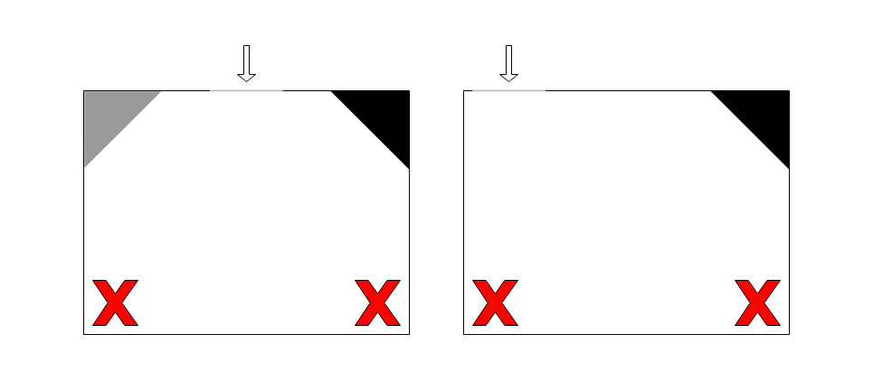

# Regeln

Für das diesjährige Qualifikationsturnier (Berlin 2022) fließen folgende Elemente in die Wertung ein:
* 2 Läufe per Video vorab (nur Parcours, ohne Evakuierungszone/Kugeln)
* Video (vorab) von der Evakuierungszone
* 1 Lauf live per Videokonferenz inkl. Evakuierungszone
* Präsentation (Video vorab, max. 15 min) einzelner Elemente

## 2 Wertungsläufe (nur Parcours) per Video

Am Montag (14.03.2022) **TODO: oder früher?** werden 3 Parcours (3x4 Kacheln) **TODO: oder 4 oder 4x4?** veröffentlicht, aus denen ihr für den Wettbewerb wählen könnt.
Bis zum Freitag (18.03.2022, 20:00) könnt ihr für 2 Läufe mit einem Parcours eurer Wahl ein Video hochladen.
Es muss sich um 2 verschiedene aus den vorgeschlagenen Parcours handeln.
Die Wertung erfolgt grundsätzlich nach den [offiziellen Regeln](https://robocup.de/de/rcj_regeln/).
Für diese Vorab-Videos gilt eine Maximalzeit von 4 Minuten für einen Lauf.
Außerdem gibt es keine Evakuierungszone im Anschluss an diesen Parcours.
Bitte macht euch noch einmal mit den Regeln vertraut, da ihr in den Vorab-Videos schließlich gleichzeitig die Rolle des Schiedsrichters einnehmt und z. B. entscheidet, ob der Roboter zurückgesetzt wird.

## Evakuierungszone per Video

Ebenso könnt ihr bis zum Freitag (18.03.2022, 20:00) ein Video der Evakuierungszone hochladen.
Bitte beachtet die Ankündigung, dass es keine Ausfahrt aus der Evakuierungszone gibt und auch kein Rescue-Kit.
Für das Retten der Opfer gibt es eine Maximalzeit von 4 Minuten.
Es gibt zwei lebende und ein totes Opfer.

Der erworbene Multiplikator (Regel 4.6.5) wird auf den Mittelwert der beiden per Video aufgezeichneten Läufe angewendet und als separate Punktzahl ausgewiesen.

`PUNKTE_VIDEO_KUGELN = (MULTIPLIKATOR - 1) * (PUNKTE_VIDEO_LAUF_1 + PUNKTE_VIDEO_LAUF_2) / 2`

Das Endergebnis wird gerundet (4.6.11), hierbei wird ab .5 aufgerundet.

Die Opfer können beliebig in der Mitte des Raumes abgelegt werden.
Der Evakuierungspunkt ist in einer Ecke zu platzieren, die an die Wand angrenzt, durch die der Roboter in die Evakuierungszone einfährt (siehe Beispielbilder).

## Wertungslauf live per Videokonferenz

Am Samstag (19.03.2022) führen wir je Team einen Wertungslauf per Videokonferenz durch.
Jedes Team kann dafür einen Parcours aus den Vorschlägen wählen, den es nicht bereits für die Vorab-Videos gewählt hat.
Für diesen Wertungslauf gibt es eine Maximalzeit von 5 Minuten.

Sollte es technische Probleme am Roboter geben und befindet sich dieser noch auf der Startkachel, kann nochmal ein neues Programm ausgewählt werden und Reparaturen aller Art können durchgeführt werden.
Die Zeit läuft allerdings weiter.

## Kurzpräsentation

Bis Mittwoch (16.03.2022, 20:00) könnt ihr eine kurze Präsentation hochladen, in der ihr bitte auf folgende Themen und Fragen eingeht:

* Wer hat welche Aufgabe im Team?
* Wie wird das Hindernis erkannt und umfahren?
* Wie erkennt ihr Kreuzungen und wie entscheidet der Roboter, welchen Abzweig er wählen muss?
* Wird die Rampe besonders behandelt (z. B. Extra-Sensoren, ein einzelner Programmabschnitt)? Falls ja, wie?
* Wie sammelt der Roboter die Opfer ein und bringt sie zum Evakuierungspunkt? Falls noch nichts gebaut/implementiert ist: Wie ist eure Idee?
* Was macht den Roboter besonders?

## Terminübersicht

| Zeitpunkt              | Termin                                    |
| ---------------------- | ----------------------------------------- |
| Mo., 14.03.2022, 08:00 | Parcoursauswahl wird verfügbar gemacht    |
| Mi., 16.03.2022, 20:00 | Upload Video Kurzpräsentation             |
| Fr., 18.03.2022, 20:00 | Upload Video 2 Läufe + 1 Evakuierungszone |
| Sa., 19.03.2022        | 1 Live-Lauf pro Team (Videokonferenz)     |
| So., 20.03.2022, ??:?? | Ergebnisse und Siegerehrung               |

## Geschätzte Maximalpunktzahlen und Zeit pro Lauf/Video

| Aufgabe      | Maximalpunktzahl | Zeit   |
| ------------ | ---------------- | ------ |
| Lauf 1 vorab | 130              | 4 min  |
| Lauf 2 vorab | 130              | 4 min  |
| Kugeln vorab | 226              | 4 min  |
| Lauf live    | 130 + 226        | 5 min  |
| Präsentation | 100              | 15 min |

## Hinweise zu Feld und Wertungselementen

In den Parcours wird es keine Rampen und Schutt (debris) geben. **TODO: Speed Bumps?**
Hindernisse sollen fest sein (zur Not durch Festhalten) und einen Durchmesser von etwa 7-15 cm haben.

**TODO: LoP**

Eine Materialliste mit benötigten Kacheln wird im Februar veröffentlicht.

## Hochladen von Videos

## Mögliche Verbindungsprobleme bei der Videokonferenz

